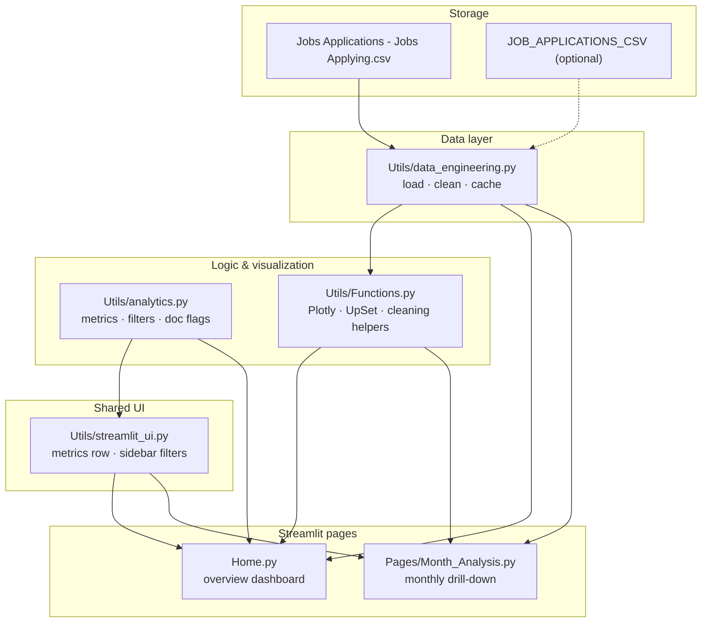
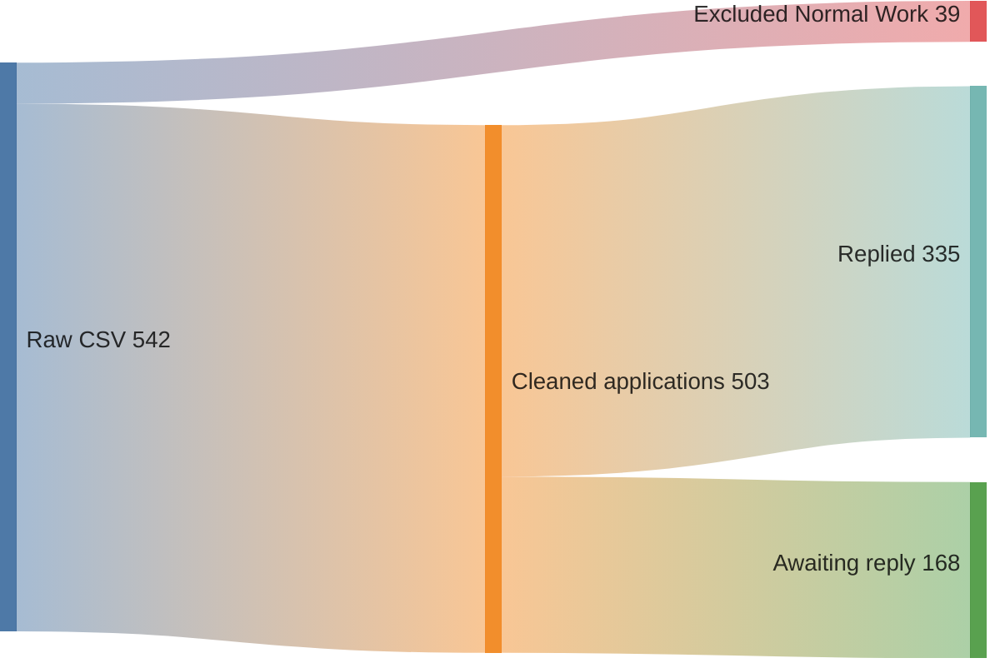

# Architecture — Job Application Dashboard

This project is organized in **layers**: storage → data pipeline → business logic & charts → shared UI → Streamlit pages.

> **Sankey vs flowchart:** A **Sankey diagram** is best when link *thickness* shows *how much* flows between stages (e.g. row counts through cleaning). A **layered flowchart** is better for *code structure* — which modules exist and what imports what. Both are included below.

Open **`architecture.html`** in a browser for an interactive rendered version of these diagrams.

---

## Module structure (code layout)



---

## Data flow (runtime — Sankey)

How application rows move through the pipeline (503 applications after filtering out **Normal Work**):



---

## What each page renders

| Page | Filters | Charts / outputs |
|------|---------|------------------|
| **Home** | Month, status, position type (sidebar) | Reply metrics · status & type pies · top cities & companies · UpSet (documents) · reply-time box plot |
| **Monthly Analysis** | Month multiselect | Reply metrics · daily stacked bars by status · status & type pies · reply-time box plot |

---

## File tree

```
job searching project/
├── Home.py                      # Entry point — overview dashboard
├── Pages/
│   └── Month_Analysis.py        # Per-month drill-down
├── Utils/
│   ├── data_engineering.py      # CSV path, load, clean, @st.cache_data
│   ├── analytics.py             # reply_metrics, filters, document parsing
│   ├── Functions.py             # Draw_bar, Draw_pie, Draw_boxplot, Draw_upset, …
│   └── streamlit_ui.py          # render_reply_metrics, render_home_filters
├── ARCHITECTURE.md              # This file (Mermaid source)
├── architecture.html            # Browser-rendered diagrams
├── test_data_engineering.py     # Pipeline smoke tests
├── requirements.txt
└── Jobs Applications - Jobs Applying.csv
```

---

## Dependency summary

| Module | Imports from | Used by |
|--------|--------------|---------|
| `data_engineering.py` | `Functions` (cleaning) | `Home`, `Month_Analysis`, `streamlit_ui`, tests |
| `analytics.py` | — | `Home`, `streamlit_ui`, tests |
| `Functions.py` | plotly, matplotlib, upsetplot | `Home`, `Month_Analysis`, `data_engineering` |
| `streamlit_ui.py` | `data_engineering`, `analytics` | `Home`, `Month_Analysis` |
